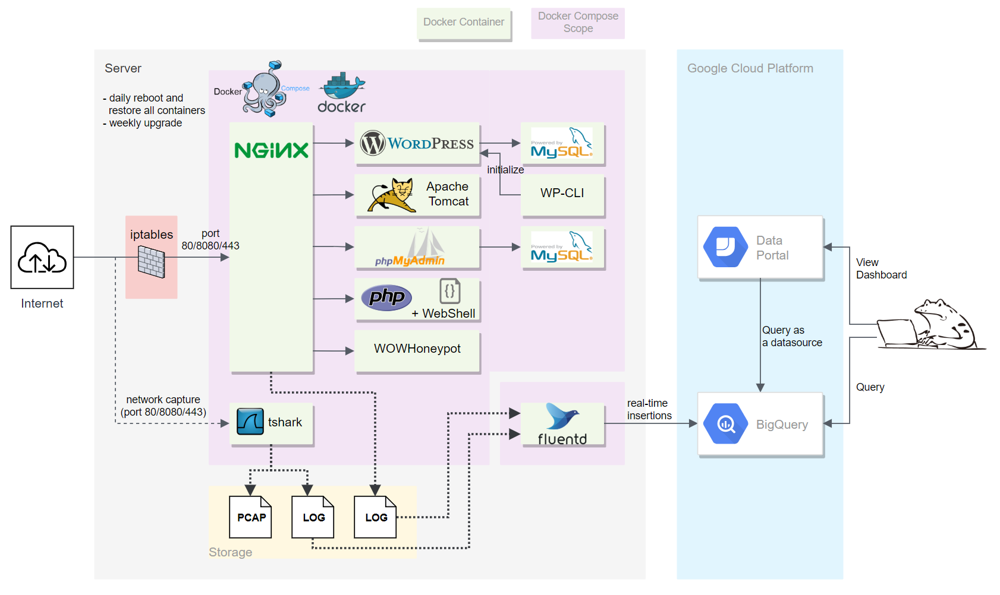
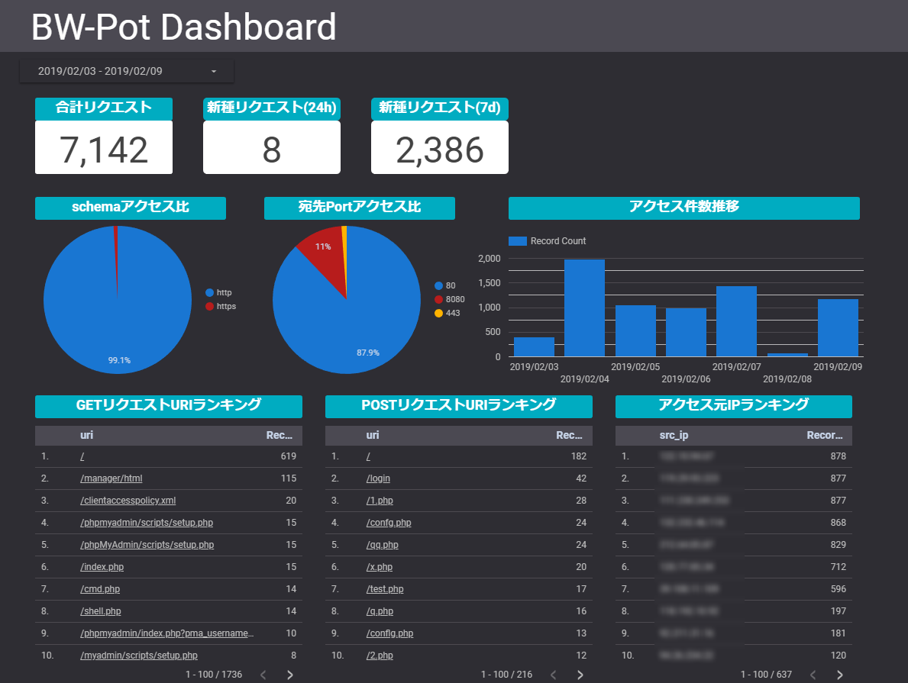

BW-Pot
====

BW-Pot (**B**reakable **W**eb applications honey**Pot**)は、HTTPまたはHTTPSを対象とする高対話型のハニーポットです。
狙われやすく侵害されやすいWebアプリケーションを構築することで、攻撃者からのアクセスを観察します。
また、ログをGoogle BigQueryに転送し、ログの蓄積および可視化を行います。

## Features
- 頻繁に攻撃のターゲットとなっているWebアプリケーション環境を使用
- 毎日、クリーンな環境に自動リストア
- Google BigQueryへのリアルタイムなログ連携
- 自動的なログローテーション
- 詳細解析用にパケットキャプチャファイルを保存
- 低スペックなサーバで運用可能

## Architecture/Specification
アーキテクチャ図は以下の通りです。

細かい仕様は、[Specification](doc/SPEC.md)を参照してください。

## Installation

### Hardware Requirements
- `2GB`RAM
- `10GB`SSD
- Internet Connection

Amazon EC2の`t2.nano`インスタンスで動作確認しています。  
`t2.nano`は`0.5GB`RAMですが、Swap領域を`2GB`確保することで動作確認しています。

### Software Requirements
- Docker
- Docker-Compose
- logrotate

### Service Account Requirements
- Google Cloud Platform Account

### Install
[Install](doc/INSTALL.md)を参照してください。

OSセットアップや必要ソフトウェアをインストールする手順は、[Preparing for installation](doc/PREPARE.md)を参照してください。

## Usage
BigQueryに転送したログを使用して、[BigQueryのWebUI](https://console.cloud.google.com/bigquery)でSQL実行による分析や、
[データポータル](https://datastudio.google.com/)でBigQueryの各テーブルをデータソースに指定してダッシュボードを作成することが可能です。

データポータルで作成したダッシュボードの例です。

また、`/data/tshark/dump/`に格納しているネットワークキャプチャファイルを端末にダウンロードしてWireShark等で確認することも可能です。

## Licenses
BW-Potが使用しているソフトウェアのライセンスは以下の通りです。
- Apache License v2: [Docker](https://www.docker.com/), [Fluentd](https://www.fluentd.org/), [Apache Tomcat](http://tomcat.apache.org/)
- GPL v2: [Wireshark(tshark)](https://www.wireshark.org/), [WordPress](https://wordpress.org/), [phpMyAdmin](https://www.phpmyadmin.net/)
- BSD License: [WOWHoneypot](https://github.com/morihisa/WOWHoneypot)

## Author
[graneed](https://twitter.com/graneed111)  

## ToDo
- WebアプリケーションにDrupalを追加
- ログ保全のためAmazon S3にログファイルを保存するサービスを追加
- iptablesにOutBoundの通信を塞ぐルールを追加
- IDS(SuricataまたはSnort)を追加
- dockerのimageを定期アップデート(docker system prune -aでimage削除して実現？)
