# Install

## 1. BW-Potサービスのインストール
`sudo su -`コマンドで、rootユーザに切り替えて作業してください。

### 1.1. githubからリポジトリ取得
```
# git clone https://github.com/graneed/bwpot.git /opt/bwpot
```

### 1.2. cronにジョブ追加
```
# cat /opt/bwpot/host/etc/crontab >> /etc/crontab
```

### 1.3. Credencial情報の編集
テンプレートファイルからコピーし、必要に応じて、各Webアプリケーションの認証情報を変更してください。  
そのままでも問題ありません。デフォルトは、攻撃者がパスワードクラックしやすいID/Passwordを設定しています。
```
# cp -p /opt/bwpot/etc/bwpot/credencials.template /opt/bwpot/etc/bwpot/credencials

# vi /opt/bwpot/etc/bwpot/credencials
```

### 1.4. SSH接続ポート用のFirewall設定
ssh接続ポートを60022以外にしている場合は、iptablesの許可対象のポートを変更してください。
```
# vi /opt/bwpot/etc/bwpot/setIptables.sh
```

### 1.5. Service化
```
ユニットファイルをコピー
# cp -p /opt/bwpot/host/etc/systemd/bwpot.service /etc/systemd/system/bwpot.service

サービス自動起動の有効化
# systemctl enable bwpot

サービス起動
# systemctl start bwpot
```

## 2. Google BigQueryのセットアップ

### 2.1. プロジェクトの作成
https://console.cloud.google.com

コンソール画面を表示し、`プロジェクトの選択`をクリックします。

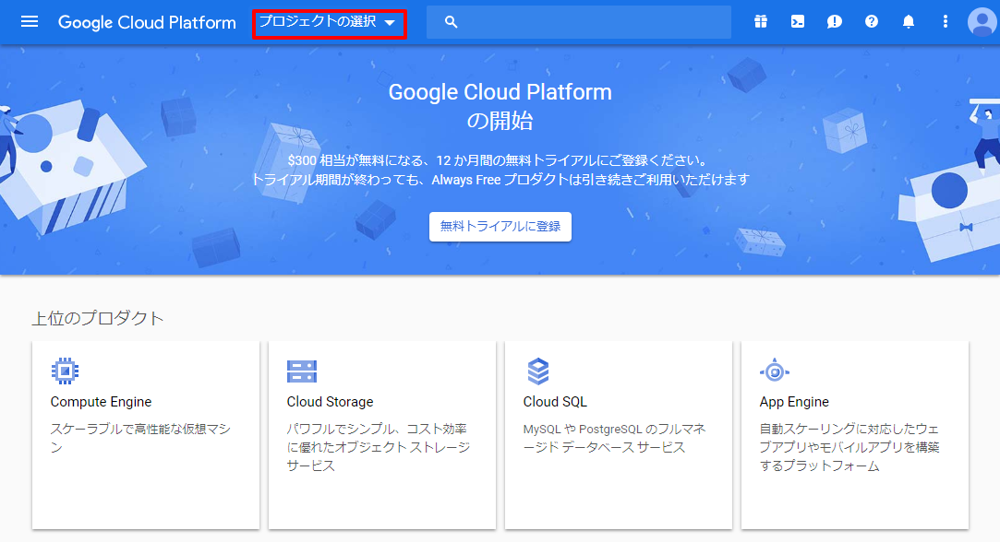

`新しいプロジェクト`をクリックします。

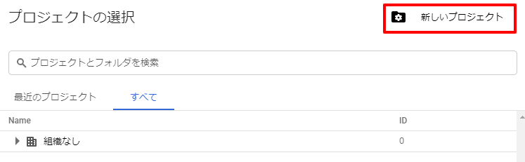

`プロジェクト名`を入力し、`作成`ボタンをクリックします。

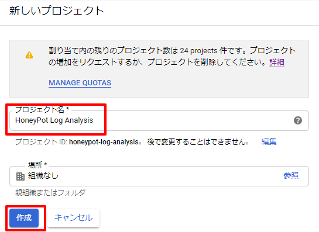

### 2.2. Google サービスアカウントの作成およびBigQuery管理権限の付与
左側のメニューから、`APIとサービス`->`認証情報`をクリックします。

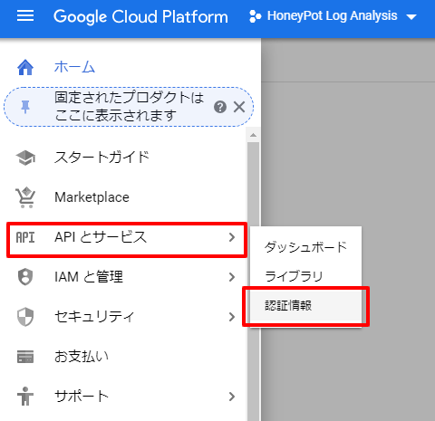

`認証情報を作成`->`ウィザードで選択`をクリックします。

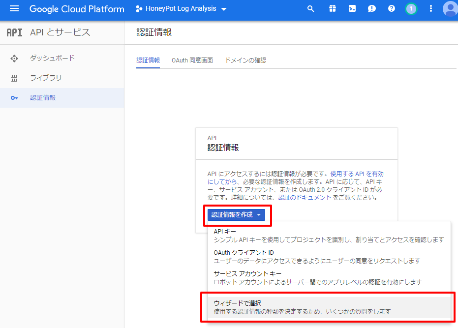

`BigQuery API`、`いいえ`を選択し、`必要な認証情報`ボタンをクリックします。

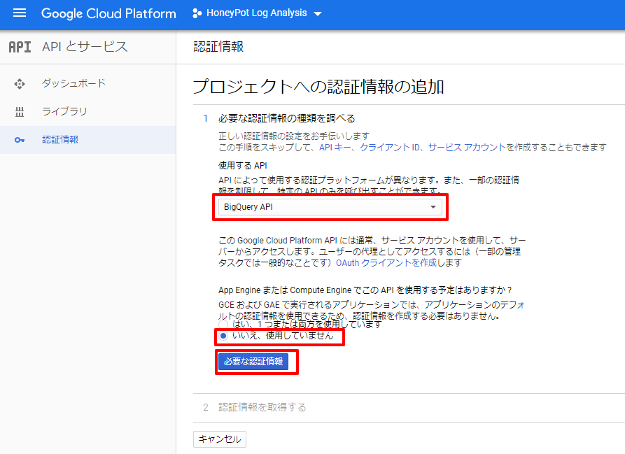

`サービスアカウント名`を入力、`BigQueryデータ編集者`を選択し、`次へ`ボタンをクリックします。

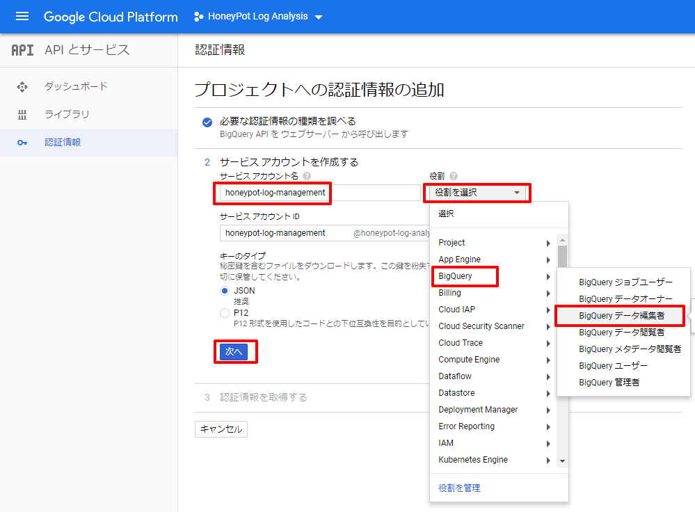

サービスアカウントのキーファイルを自動でダウンロードします。後で使用します。

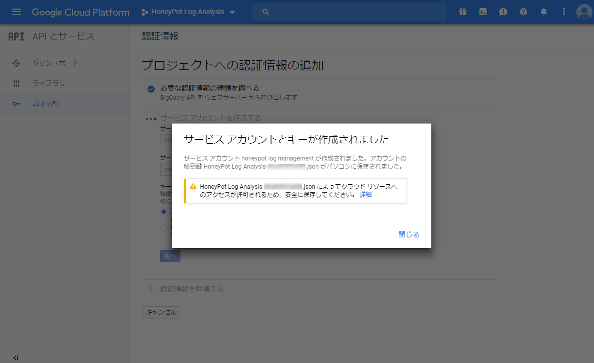

### 2.3. データセットの作成
https://console.cloud.google.com/bigquery

先ほど作成したプロジェクトを選択し、`データセットを作成`をクリックします。

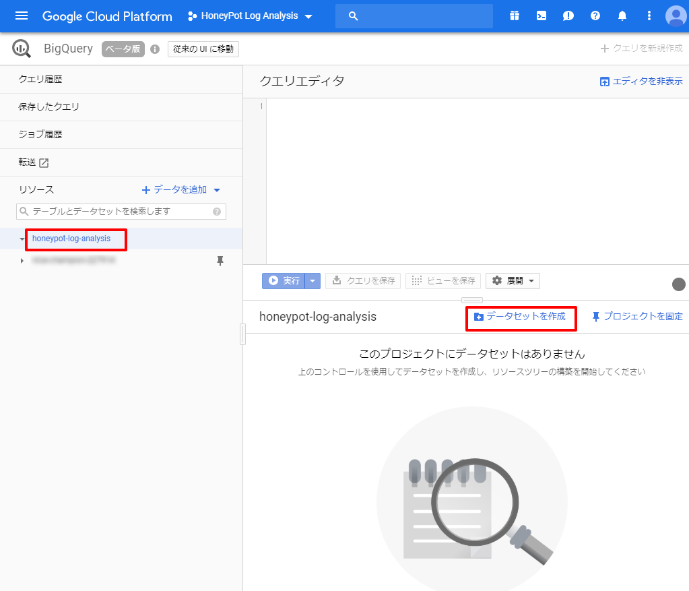

`データセットID`を入力、`データのロケーション`を選択し、`データセットを作成`ボタンをクリックします。

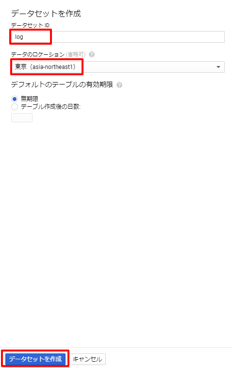

### 2.4. テーブルの作成
先ほど作成したデータセットを選択し、`テーブルを作成`をクリックします。

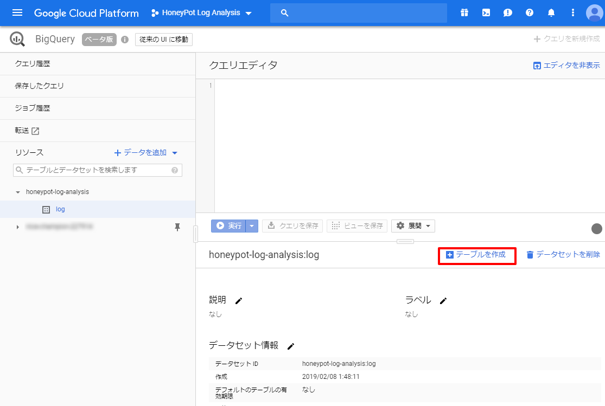

`テーブル名`に`nginx_access`を入力します。  
`テキストとして編集`を選択し、[nginx_accessテーブルのスキーマ](../docker/fluentd/dist/nginx_access_schema.json)をコピーして貼り付けます。  
`パーティショニング`に`time`を選択します。  
最後に、`テーブルを作成`ボタンをクリックします。

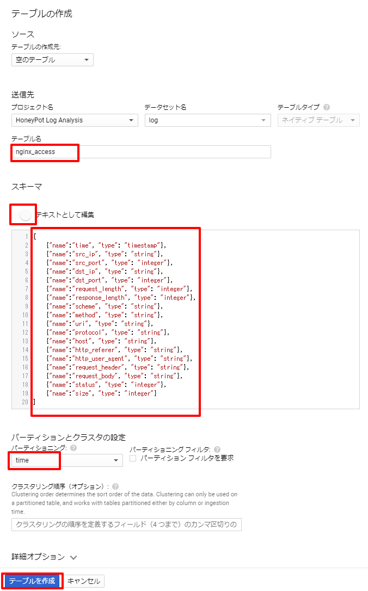

`テーブル名`に`tshark_payload`を入力します。  
`テキストとして編集`を選択し、[tshark_payloadテーブルのスキーマ](../docker/fluentd/dist/tshark_payload_schema.json)をコピーして貼り付けます。  
`パーティショニング`に`time`を選択します。  
最後に、`テーブルを作成`ボタンをクリックします。

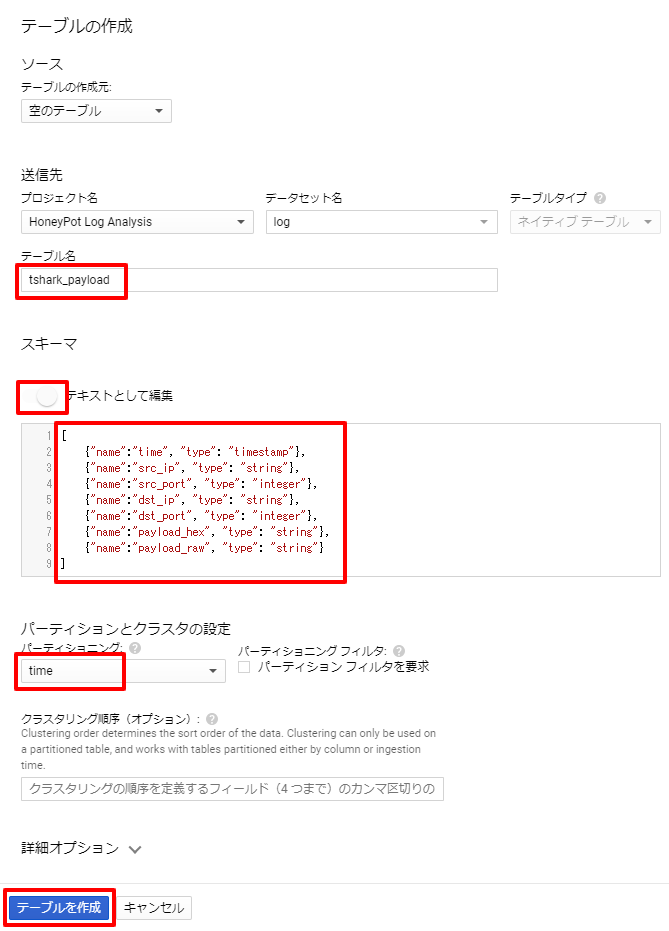


## 3. Fluentdサービスのインストール
`sudo su -`コマンドで、rootユーザに切り替えて作業してください。

### 3.1. Google サービスアカウントのキーファイルを配備
ダウンロード済みのサービスアカウントのキーファイルを`/opt/bwpot/etc/fluentd/service_account_key.json`に配備します。
SCPコマンド等でファイル転送してもよいですし、viで編集を開始してコピー＆ペーストしてもよいです。

### 3.2. Credencial情報の編集
テンプレートファイルからコピーし、Google BigQueryのProject名とDataset名をセットしてください。
```
# cp -p /opt/bwpot/etc/fluentd/credencials.template /opt/bwpot/etc/fluentd/credencials

# vi /opt/bwpot/etc/fluentd/credencials
```

### 3.3. Service化
```
ユニットファイルをコピー
# cp -p /opt/bwpot/host/etc/systemd/fluentd.service /etc/systemd/system/fluentd.service

サービス自動起動の有効化
# systemctl enable fluentd

サービス起動
# systemctl start fluentd
```

## 4. テスト

### 4.1. Dockerコンテナの起動状態確認
Dockerコンテナが起動していることを確認します。

```
# docker ps
CONTAINER ID        IMAGE                 COMMAND                  CREATED             STATUS              PORTS                                                              NAMES
a3ef6ab8d682        fluentd_fluentd       "/bin/entrypoint.sh …"   2 minutes ago       Up About a minute   5140/tcp, 24224/tcp                                                fluentd
c8dc8e3ac3cf        bwpot_phpmyadmin      "/run.sh supervisord…"   3 minutes ago       Up 2 minutes        80/tcp, 9000/tcp                                                   phpmyadmin
d9a2218b3447        bwpot_wordpress       "docker-entrypoint.s…"   3 minutes ago       Up 2 minutes        80/tcp                                                             wordpress
3aef26c0bdae        bwpot_wordpress-db    "docker-entrypoint.s…"   3 minutes ago       Up 3 minutes        3306/tcp, 33060/tcp                                                wordpress-db
02b1e8bd78f9        bwpot_nginx           "nginx -g 'daemon of…"   3 minutes ago       Up 2 minutes        0.0.0.0:80->80/tcp, 0.0.0.0:443->443/tcp, 0.0.0.0:8080->8080/tcp   nginx
e0a179220581        bwpot_wowhoneypot     "python3 wowhoneypot…"   3 minutes ago       Up 3 minutes        8080/tcp                                                           wowhoneypot
6c6148000ef4        bwpot_phpmyadmin-db   "docker-entrypoint.s…"   3 minutes ago       Up 3 minutes        3306/tcp, 33060/tcp                                                phpmyadmin-db
84dbcca6c386        bwpot_webshell        "docker-php-entrypoi…"   3 minutes ago       Up 3 minutes        80/tcp                                                             webshell
84456bf50ddd        bwpot_tomcat          "catalina.sh run"        3 minutes ago       Up 3 minutes        8080/tcp                                                           tomcat
c8fc4de73134        bwpot_tshark          "/bin/sh -c 'ip=`ip …"   3 minutes ago       Up 3 minutes                                                                           tshark
```

### 4.2. 各Webアプリケーションの稼働確認

#### 4.2.1. WordPress
WordPressのログイン画面のレスポンスを確認します。
```
$ curl http://localhost/wp-login.php
```

#### 4.2.2. phpMyAdmin
phpMyAdminのログイン画面のレスポンスを確認します。
```
$ curl http://localhost/phpMyAdmin/
```

#### 4.2.3. Apache Tomcat
Apache TomcatのBASIC認証失敗画面のレスポンスを確認します。
```
$ curl http://localhost/manager/html/
```

#### 4.2.4. PHP WebShell
`fuga`メッセージのレスポンスを確認します。
```
$ curl http://localhost/hoge.php -d 'a=die("fuga\n")'
```

#### 4.2.5. WOWHoneypot
シンプルなログイン画面のレスポンスを確認します。
```
$ curl http://localhost/login
```

### 4.3. Google BigQueryのログ確認
[BigQueryのWebUI](https://console.cloud.google.com/bigquery)で適当なSELECT文を実行し、ログが連携されていることを確認します。
```sql
SELECT * FROM `honeypot-log-analysis.log.nginx_access` LIMIT 1000
```
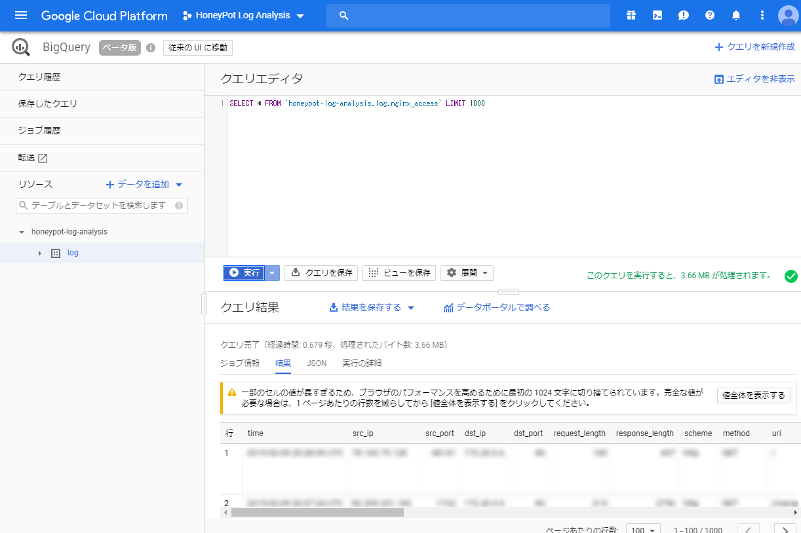
